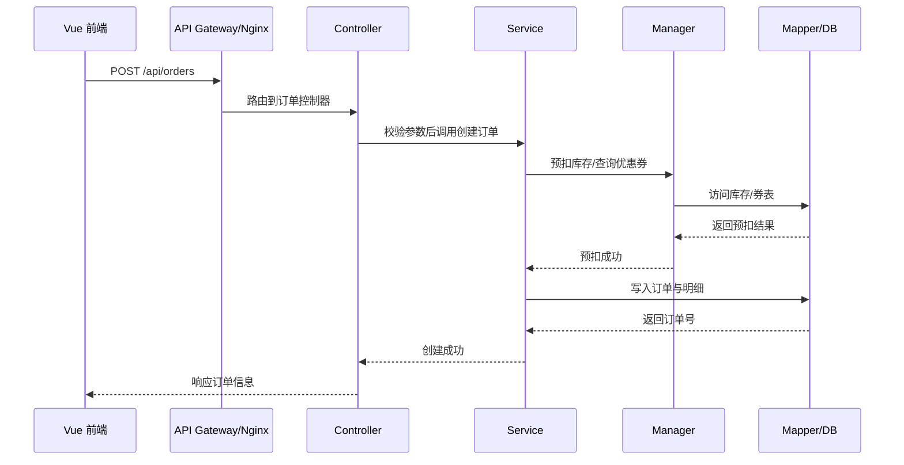
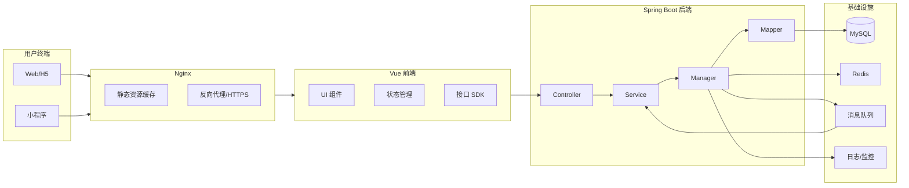
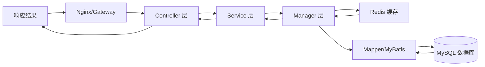

# 架构设计文档（Architecture Design Document）

## 1. 系统架构分层
- **Controller 层**：暴露 REST API，参数校验、鉴权与异常处理，调用 Service 层。
- **Service 层**：业务编排与领域逻辑，事务控制、幂等校验、事件发布。
- **Manager 层**：跨领域协调，封装第三方/网关调用、缓存/消息等基础设施能力。
- **Mapper 层**：持久化访问，MyBatis 映射、读写分离、分库分表适配。

## 2. 前后端整体架构说明
- **前端（Vue）**：
  - Vite + Vue3 + TypeScript，组件化 + 路由懒加载，Pinia 管理全局状态，Axios 封装 API SDK。
  - UI 基于 Element Plus，内置布局、表单与表格组件，配合权限指令控制可见性。
- **后端（Spring Boot）**：
  - Spring MVC 提供 REST API，Spring Security/JWT 负责鉴权，MyBatis/Mapper 访问 MySQL。
  - Redis 提供缓存、Session、分布式锁，MQ（RabbitMQ/Kafka）用于异步削峰与事件驱动。
  - Nginx 作为边缘接入与静态资源分发，前后端通过 API 网关路径路由。

## 3. 重要模块协作流程（API 调用链）


## 4. 设计模式使用
- **工厂模式**：支付渠道、消息客户端的创建统一交给 Factory，隔离配置与实例化细节。
- **策略模式**：优惠计算、运费计算、支付回调处理等按策略扩展，支持多场景切换。
- **模板方法模式**：订单创建/退款流程抽象模板，步骤可在钩子中覆写（如风控、积分）。
- **责任链模式**：请求参数校验、风控校验、库存校验按链路执行，便于增删节点。

## 5. 目录结构与模块职责
```
./saki-ai-code-tool-backend/
├─ src/main/java/
│  ├─ controller/    # API 层，入参与响应模型
│  ├─ service/       # 业务逻辑、事务、领域服务
│  ├─ manager/       # 组合基础设施、第三方/网关调用
│  ├─ mapper/        # MyBatis Mapper 接口
│  ├─ domain/        # 实体、聚合根、DTO、VO
│  └─ config/        # 安全、数据源、缓存、MQ 配置
└─ src/main/resources/
   ├─ application.yml
   └─ mapper/*.xml

./saki-ai-code-mother-frontend/
├─ src/
│  ├─ api/           # Axios 封装与接口声明
│  ├─ components/    # 通用组件
│  ├─ pages/         # 业务页面
│  ├─ router/        # 路由配置与守卫
│  ├─ stores/        # Pinia 状态管理
│  └─ styles/        # 主题与全局样式
└─ package.json
```

## 6. 系统架构图


## 7. 数据流转流程图（请求 → 后端 → 数据库）

