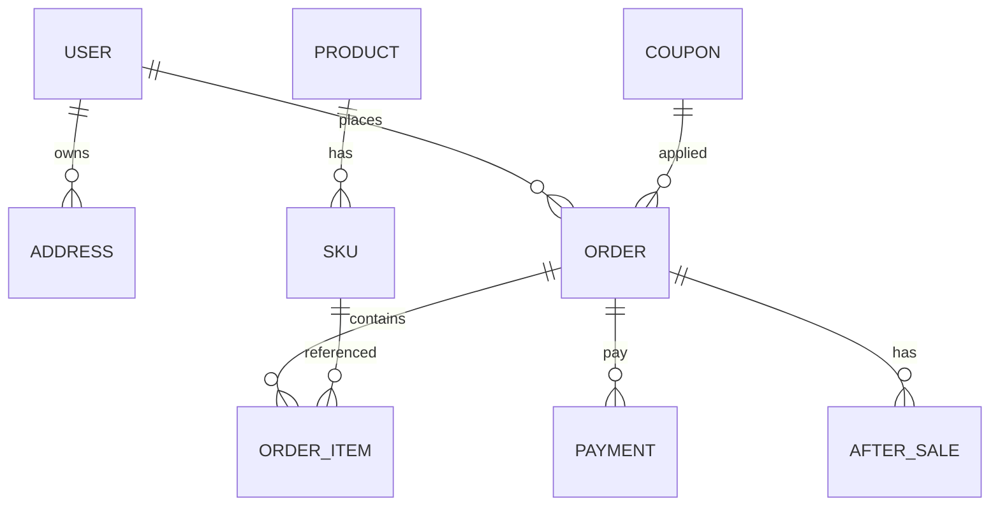

# 数据库设计文档（Database Documentation）

## 1. ER 图

## 2. 表结构说明
### 2.1 用户与地址
- **user** (`id` PK, `username`, `phone`, `email`, `password_hash`, `status`, `created_at`, `updated_at`)
- **address** (`id` PK, `user_id` FK -> user.id, `receiver`, `phone`, `province`, `city`, `district`, `detail`, `is_default`, `created_at`)

### 2.2 商品与库存
- **product_spu** (`id` PK, `title`, `sub_title`, `brand_id`, `category_id`, `status`, `created_at`, `updated_at`)
- **product_sku** (`id` PK, `spu_id` FK -> product_spu.id, `sku_code`, `price`, `stock`, `sale_attr`, `status`, `created_at`, `updated_at`)
- **inventory_log** (`id` PK, `sku_id`, `change`, `type`, `biz_ref`, `created_at`)

### 2.3 订单与明细
- **order** (`id` PK, `order_no` unique, `user_id` FK -> user.id, `total_amount`, `pay_amount`, `coupon_id`, `status`, `pay_channel`, `pay_time`, `address_snapshot`, `created_at`, `updated_at`)
- **order_item** (`id` PK, `order_id` FK -> order.id, `sku_id` FK -> product_sku.id, `quantity`, `price`, `discount_amount`, `real_amount`, `status`)

### 2.4 支付与营销
- **payment** (`id` PK, `order_id` FK -> order.id, `payment_no`, `channel`, `amount`, `status`, `notify_payload`, `created_at`)
- **coupon** (`id` PK, `code` unique, `name`, `type`, `scope`, `threshold`, `discount`, `start_time`, `end_time`, `status`)
- **coupon_record** (`id` PK, `coupon_id` FK -> coupon.id, `user_id`, `status`, `order_id`, `used_time`)

### 2.5 评价与售后
- **review** (`id` PK, `order_id`, `sku_id`, `user_id`, `rating`, `content`, `images`, `status`, `created_at`)
- **after_sale** (`id` PK, `order_id` FK -> order.id, `type`, `reason`, `status`, `refund_amount`, `evidence`, `logistics_no`, `created_at`, `updated_at`)

## 3. 主键、外键、索引
- 所有主键使用自增或雪花 ID；`order_no`、`payment_no` 设置唯一索引。
- 常用查询索引：`order(user_id, created_at)`、`order_item(order_id)`、`product_sku(spu_id, status)`、`coupon_record(user_id, status)`。
- 外键逻辑上约束，物理层面可视性能选择开启或通过应用保证一致性。

## 4. 表关系说明
- **订单 → 订单商品列表**：`order.id` 对应多条 `order_item` 记录。
- **订单 → 支付记录**：一对多，便于多次支付尝试或多支付渠道。
- **订单 → 售后记录**：一对多，支持按商品/整单申请售后。
- **用户 → 地址/订单/优惠券**：一对多关联，支持用户画像与复购分析。
- **商品 → SKU**：一对多，SKU 与订单明细关联，支持规格化库存管理。

## 5. 数据设计核心逻辑
- **库存扣减方案**：下单时预扣库存（Redis/DB），支付成功后实扣；取消/支付超时回补库存，使用库存日志记录幂等。
- **订单号生成规则**：`时间戳前缀 + 业务线标识 + 随机序列`，保证全局唯一且可追溯。
- **支付幂等**：支付回调按 `payment_no + channel` 幂等键处理，状态机防止重复扣减。
- **优惠券核销**：下单核验优惠券状态与有效期，成功后占用记录，支付失败则释放。

## 6. Redis 缓存策略
| Key 模式 | 示例 | 有效期 | 用途 |
| --- | --- | --- | --- |
| `prod:sku:{skuId}` | `prod:sku:1001` | 30 min | 商品详情缓存，减轻 DB 压力 |
| `stock:sku:{skuId}` | `stock:sku:1001` | 5 min | 实时库存缓存，结合分布式锁防超卖 |
| `cart:{userId}` | `cart:123` | 7 day | 用户购物车数据 |
| `coupon:lock:{couponId}:{userId}` | `coupon:lock:8:123` | 15 min | 核券占用锁，防止并发使用 |
| `order:pay:token:{orderNo}` | `order:pay:token:2024xxx` | 30 min | 支付幂等 Token，防止重复支付 |
