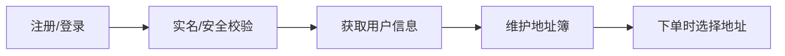
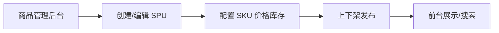
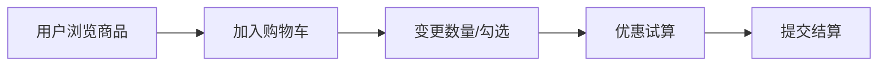
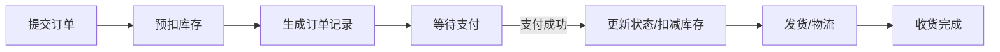
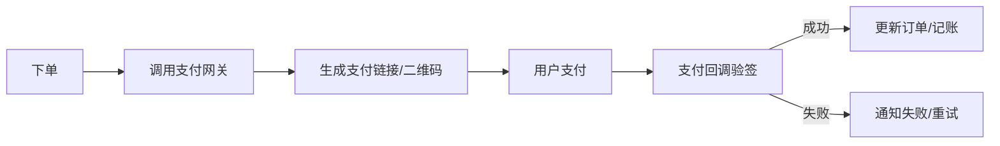
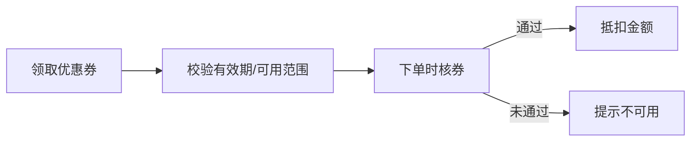
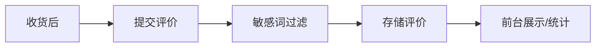
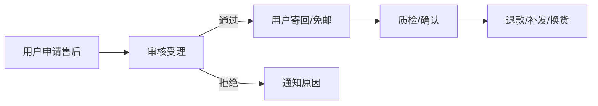
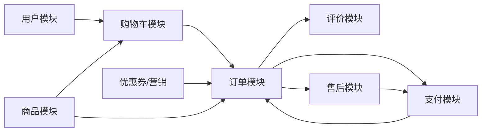

# 功能设计文档（Feature Design Document）

> 面向电商场景的业务功能设计，覆盖用户、商品、订单、支付、评价与售后全链路。

## 1. 模块清单与功能说明
- **用户模块**：注册、登录、OAuth、个人信息、地址簿、账号安全。
- **商品模块**：类目、品牌、SKU/SPU、价格、库存、上下架、搜索与推荐。
- **购物车模块**：加购、变更数量、选择优惠、勾选结算、合并购物车。
- **订单模块**：创建订单、拆单、运费/优惠计算、订单查询、取消/关闭、物流跟踪。
- **支付模块**：多渠道（支付宝/微信/银行卡）、支付二维码/跳转、回调校验、退款。
- **优惠券与营销模块**：领券、核券、满减、限时折扣、活动白名单/黑名单。
- **评价模块**：评价提交、追加评价、图片上传、敏感词过滤、申诉。
- **售后模块**：退货、换货、仅退款、逆向物流、客服沟通、仲裁。

## 2. 模块业务流程图
### 2.1 用户模块

### 2.2 商品模块

### 2.3 购物车模块

### 2.4 订单模块

### 2.5 支付模块

### 2.6 优惠券与营销模块

### 2.7 评价模块

### 2.8 售后模块

## 3. 模块状态机
- **订单状态**：`待支付 -> 待发货 -> 待收货 -> 已完成 -> 已关闭`，中间可穿插`退款中/已退款`。
- **支付状态**：`未支付 -> 支付中 -> 已支付 -> 支付失败/超时`。
- **售后状态**：`待审核 -> 待寄回/待上门取件 -> 质检中 -> 待退款/待补发 -> 完成`，可能存在`拒绝/取消`分支。
- **库存状态**：`可售 -> 预扣 -> 已扣减 -> 回补`。

## 4. 关键字段与接口
- **用户**：`id`、`phone/email`、`password_hash`、`status`、`roles`。
- **商品**：`spu_id`、`sku_id`、`title`、`price`、`stock`、`status`、`attributes`。
- **订单**：`order_id`、`user_id`、`total_amount`、`pay_amount`、`status`、`pay_channel`、`pay_time`、`coupon_id`、`address_id`。
- **支付**：`payment_id`、`order_id`、`channel`、`trade_no`、`amount`、`status`、`notify_payload`。
- **售后**：`after_sale_id`、`order_id`、`type`、`reason`、`status`、`evidence`、`refund_amount`。

**关键接口（示例）**
- `/api/auth/login`：账号登录，返回 Token 与用户信息。
- `/api/products/{id}`：获取商品详情（含 SKU 列表、库存、价格）。
- `/api/cart`：管理购物车项（增删改查）。
- `/api/orders`：创建订单、查询订单列表与详情、取消订单。
- `/api/pay/notify`：支付回调验签并更新订单。
- `/api/aftersale`：提交/查询售后申请，上传物流单号。

## 5. 模块依赖关系图

