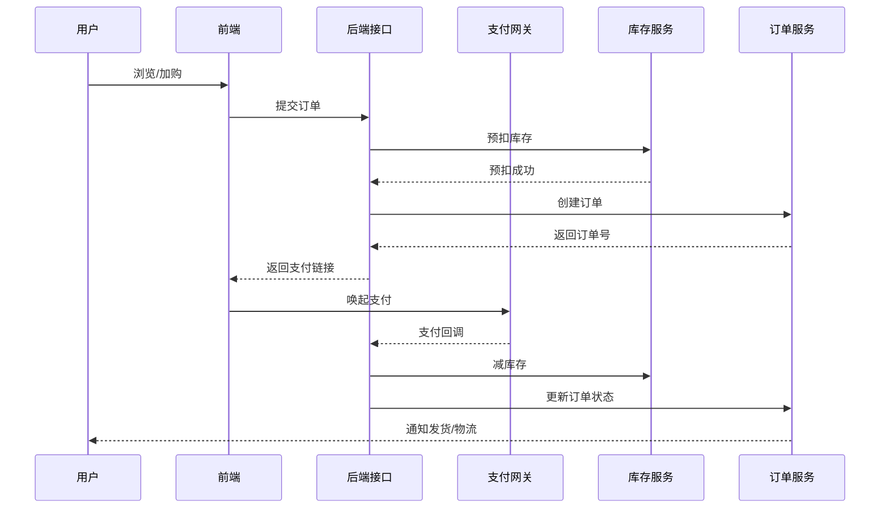

# 项目总览（Project Overview）

## 1. 项目简介
- **项目定位**：面向中小电商的全栈示例项目，提供从商品展示、下单、支付到售后的一体化能力。
- **解决问题**：帮助团队快速搭建可扩展、可维护的电商基础平台，并提供标准化的开发、部署与运维范式。

## 2. 系统角色
- **访客/用户**：浏览、搜索、下单、支付、评价、申请售后。
- **商家/运营**：商品管理、库存维护、营销配置、订单处理、售后审核。
- **管理员**：账号/权限管理、平台配置、数据监控与审计。

## 3. 核心功能模块
- **账号与权限**：注册、登录、OAuth、RBAC 权限控制。
- **商品与类目**：商品信息、价格、库存、属性、类目管理。
- **购物车与订单**：加购、优惠计算、下单、拆单、物流跟踪。
- **支付与结算**：多支付渠道、支付回调、对账、退款。
- **营销中心**：优惠券、满减、活动配置。
- **评价与内容**：商品评价、晒单、违规过滤。
- **售后服务**：退货/换货、退款、售后沟通。
- **运营支撑**：消息通知、日志审计、数据看板。

## 4. 前后端整体架构图
```mermaid
flowchart LR
    subgraph Client[客户端]
        U[Web / H5 / 小程序]
    end
    subgraph Frontend[Vue 前端]
        FE[Vue3 + Vite + Pinia]
    end
    subgraph Gateway[Nginx / API 网关]
        NG[Nginx 反向代理]\nHTTPS/HTTP2
    end
    subgraph Backend[Spring Boot 微服务]
        API[API 层]
        Service[业务服务层]
        MQ[消息队列]
        Cache[Redis 缓存]
        DB[(MySQL 集群)]
    end

    U --> FE --> NG --> API
    API --> Service
    Service --> Cache
    Service --> MQ
    Service --> DB
    MQ --> Service
```

## 5. 技术栈说明
- **后端**：Spring Boot、Spring MVC、Spring Security、MyBatis、Spring Data Redis、RabbitMQ/Kafka（可选）。
- **前端**：Vue3、Vite、TypeScript、Pinia、Vue Router、Axios、Element Plus。
- **基础设施**：MySQL、Redis、Nginx、Docker Compose/K8s 部署、GitHub Actions/CI。
- **观测与运维**：日志（SLF4J + Logback）、链路追踪（OpenTelemetry）、监控（Prometheus + Grafana）。

## 6. 系统亮点与设计特色
- **分层解耦**：Controller / Service / Manager / Mapper 清晰分层，便于扩展与测试。
- **领域建模**：围绕商品、订单、库存、支付等核心域建模，支持后续微服务拆分。
- **高并发友好**：缓存 + 限流 + 消息队列削峰，预留异步补偿与重试机制。
- **可观测性**：标准化日志、链路追踪与指标，方便排障与容量规划。
- **可扩展性**：策略模式、模板方法等模式沉淀，便于接入多支付、多物流等能力。
- **安全合规**：RBAC、数据脱敏、幂等校验、防重放、防刷限流。

## 7. 整体业务流程图


## 8. 项目目录结构（后端 + 前端）
```
./
├─ docs/                      # 项目文档
├─ saki-ai-code-tool-backend/ # Spring Boot 后端代码
│  ├─ src/main/java/...       # 控制器、服务、管理、数据访问
│  ├─ src/main/resources/     # application.yml、Mapper XML、静态资源
│  └─ build.gradle / pom.xml  # 构建脚本
└─ saki-ai-code-mother-frontend/ # Vue 前端代码
   ├─ src/                    # 组件、路由、状态、API 封装
   ├─ public/                 # 公共资源
   └─ package.json            # 前端依赖与脚本
```
